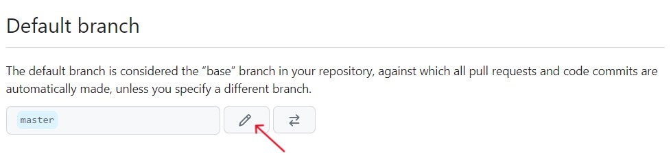
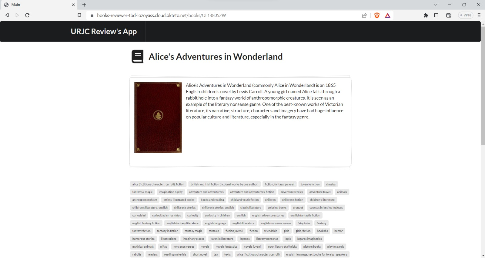

# AIS-Practica-3-2023
# Convocatoria Extraordinaria
Autores: Daniel García Redondo y Jorge Lozoya Astudillo

Enlace al [Repositorio](https://github.com/lozoyass/ais-j.lozoya.2020-tbd.git)

Enlace a la [Aplicación Okteto](https://books-reviewer-tbd-lozoyass.cloud.okteto.net/)

<br>

## Introducción

El enfoque de desarrollo que hemos utilizado en este proyecto ha sido **Trunk-based development**, el cual, a diferencia de otros métodos, se centra en la integración continua y la entrega rápida de cambios en la rama principal "trunk". 

Además, adoptamos el enfoque "TBD para equipos grandes". En el TBD clásico, las ramas de nuevas features pueden durar bastante tiempo, mientras que con este enfoque, el desarrollo se realiza en ramas de vida corta (2 días como máximo).

Otra característica importante de TBD es que el código de trunk **siempre está listo para ser desplegado en producción**, mientras que con git flow pueden pasar días o semanas hasta que hay un nuevo commit en master para ser desplegado. Por eso, el uso de pruebas (test) automatizadas desempeña un papel fundamental. 

## Desarrollo con TBD

### Clonamos el repositorio 
En nuestro caso, se nos proporciona una url a un repositorio plantilla desde el cual hemos creado nuestro repositorio. 
Dicha plantilla se encuentra en el siguiente [enlace](https://github.com/URJC-AIS/AIS-Practica-3-2023-template)

### Modificamos el nombre de la rama principal
Como vamos a trabajar aplicando TBD, es fundamental que el nombre de la rama principal se llame "trunk" y no "master" como se llama actualmente. Vamos a realizar esa modificación desde la interfaz de github, ya que no hemos sido capaces de hacerlo mediante comandos git. 

- Hacemos click en **Settings** y se nos muestra el siguiente campo



Hacemos click donde señala la flecha y cambiamos el nombre de **master** a **trunk**. 

<br>

### Creación de los workflows
En nuestro caso los metemos directamente sobre trunk ya que esta rama siempre se considera lista para producción.
```
git add .
git commit -m "Workflows creados"
git push 
```
<br>

Una vez añadidos los workflows al repositorio, podemos comenzar a desarrollar la nueva funcionalidad. 

### Desarrollo de una nueva funcionalidad
En primer lugar vamos a crear una nueva rama feature desde trunk.
```
$ git checkout -b feature/book-description-limit
Switched to a new branch 'feature/book-description-limit'
```

Para el desarrollo de esta nueva funcionalidad, vamos a modificar el contenido de la clase BookDetail: 
- Creamos un método privado llamado checkBookDescriptionLength. 
- Dicho método acorta la longitud de la descripción de un libro si esta supera los 950 caracteres, añadiendo tres puntos (...) a partir del siguiente carácter, tal y como se especifica en el enunciado. 
- En el método getDescription(), vamos a devolver una llamada a este nuevo método. 
- En el método toString(), a la hora de llamar a la descripción del libro, llamamos a este nuevo método. 

```
private String checkBookDescriptionLength() {
        if (description.length() > MAX_BOOK_DESCRIPTION_LENGTH) {
            String descriptionShorted = description.substring(0, MAX_BOOK_DESCRIPTION_LENGTH-1);
            descriptionShorted += "...";
            return descriptionShorted;
        }
        else {
            return description;
        }
    }
    
public String getDescription() {
        return checkBookDescriptionLength();
    }
    
@Override
    public String toString() {
        return "BookDetail [description=" + checkBookDescriptionLength() + ", imageUrl=" + imageUrl + "]";
    }
```

<br>

- Publicamos la rama en el repositorio remoto. Lo hacemos lo antes posible ya que así otros miembros del equipo pueden verla y colaborar en ella. 
```
$ git commit -m "Feature: límite en la descripción de los libros implementado."
$ git push origin feature/book-description-limit
Total 0 (delta 0), reused 0 (delta 0), pack-reused 0
remote:
remote: Create a pull request for 'feature/book-description-limit' on GitHub by visiting:
remote:      https://github.com/lozoyass/ais-d.garciar.2020-j.lozoya.2020-2023-tbd/pull/new/feature/book-description-limit
remote:
To https://github.com/lozoyass/ais-d.garciar.2020-j.lozoya.2020-2023-tbd.git
 * [new branch]      feature/book-description-limit -> feature/book-description-limit
```
<br>

#### Se activa el workflow 1 tras hacer el push de la nueva rama feature:
Enlace: [Wokflow1](enlace)
<br>

Este workflow se encarga de asegurar que todos los cambios realizados en la rama feature funcionen con la build actual. Como workflow no lanza ningún error, esto significa que todo está correcto y que podemos integrar con la rama de producción.

Ahora creamos una pull request desde GitHub, de la rama que acabamos de subir (feature/book-description-limit) a la rama trunk
Mergeamos los cambios

<br>

#### Se activa el workflow 2 tras la pull request que acabamos de crear
Enlace: [Wokflow2](enlace)
<br>

Este workflow se ejecuta cuando integramos con la rama de producción (trunk). A diferencia del anterior, este ejecuta todas las pruebas a excepción del sanity test. 

Desde la rama trunk actualizamos. 
```
$ git checkout trunk
$ git pull
```
<br>

Una vez mergeados los cambios que implementan la nueva funcionalidad, pasamos a crear la rama de la release
```
git checkout -b release/0-2-0
```
### Se activa el workflow 3 tras crear la rama release:
Enlace: [Wokflow3](enlace)
<br>

Este workflow está configurado de tal manera que se ejecutará cuando se cree una rama release. Tiene varios pasos: 
- Ejecuta todas las pruebas 
- Publica una versión de la aplicación como imagen Docker en DockerHub. Su versión es el hash del commit. 
Enlace a la imagen: []()
- Desplegará dicha versión en Okteto. El nombre de la aplicación es **books-reviewer**. 
Captura de pantalla del navegador: 


<br>

### Workflow 4
Enlace: [Workflow4]()
<br>

El workflow 4 está configurado para que se ejecute en la madrugada. Se encargará de ejecutar todas las pruebas y de publicar una imagen Docker en DockerHub con una versión de desarrollo etiquetada como dev-*fecha*. 
<br>

Enlace: []()

